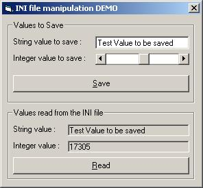

## Easy INI file manipulation

### Description

An easy way to handle INI files by using API. Ini files can be useful when you need to save and load data to and from a file. I tend to use them to save user preferences but can be used for many other things as well. The main advantage over the registry is that you can modify them easily by using a text editor such as notepad. Enjoy :)
 
### More Info
 

             |
---                |---
**Submitted On**   |2003-07-08 05:38:08
**By**             |[Miltiadis Kritikos](https://github.com/Planet-Source-Code/PSCIndex/blob/master/ByAuthor/miltiadis-kritikos.md)
**Level**          |Beginner
**User Rating**    |5.0 (20 globes from 4 users)
**Compatibility**  |VB 6\.0
**Category**       |[Files/ File Controls/ Input/ Output](https://github.com/Planet-Source-Code/PSCIndex/blob/master/ByCategory/files-file-controls-input-output__1-3.md)
**World**          |[Visual Basic](https://github.com/Planet-Source-Code/PSCIndex/blob/master/ByWorld/visual-basic.md)
**Archive File**   |[Easy\_INI\_f161147782003\.zip](https://github.com/Planet-Source-Code/miltiadis-kritikos-easy-ini-file-manipulation__1-46728/archive/master.zip)

### Source Code

<h1>INI FILES</h1>

I was inspired to write this piece of code after I saw a post, here on PSC, that asked people to use the registry instead of INI files. This post can be found here: http://www.planet-source-code.com/vb/scripts/ShowCode.asp?txtCodeId=46726&lngWId=1

I can't say whether to use the registry or INI files. I personally prefer INI files because :
<ul>
<li>they are easier to modify externally by using notepad which is useful for testing the program with different settings</li>
<li>are very easy to program (see source code)</li>
<li>and when you want to delete your program, you just delete the project folder and the Ini files are deleted as well; so you don't have to search to delete useless entries in the registry</li></ul>

I use the registry when I want to share information between different applications. For example I save the path where my program is installed in the registry in case I want to install an extension such as a plug-in or an upgrade, I will know where the program can be found by reading that registry value.

